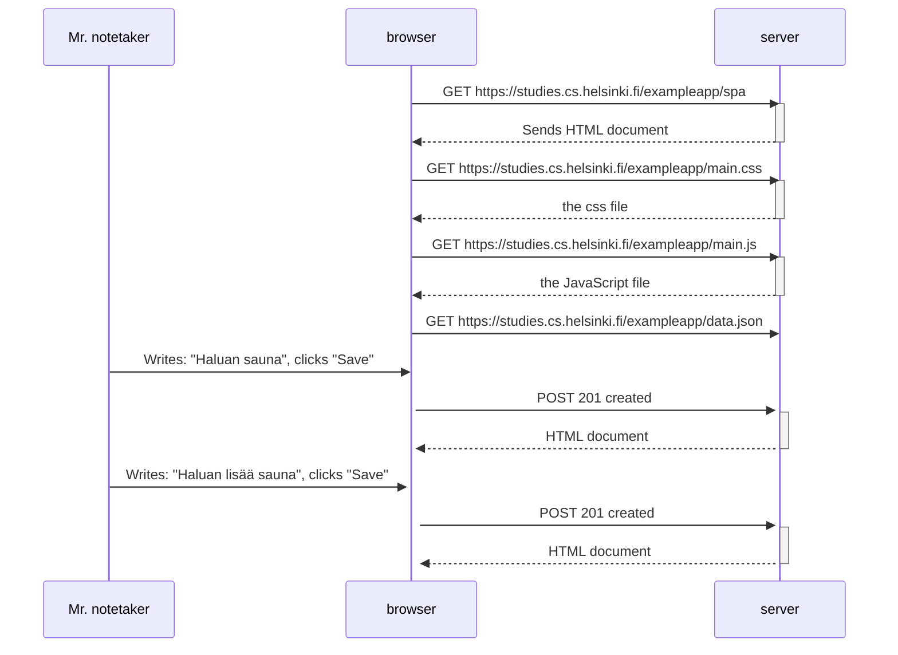

```mermaid
sequenceDiagram
    participant Mr. notetaker
    participant browser
    participant server

    browser->>server: GET https://studies.cs.helsinki.fi/exampleapp/spa
    activate server
    server-->>browser: Sends HTML document
    deactivate server

    browser->>server: GET https://studies.cs.helsinki.fi/exampleapp/main.css
    activate server
    server-->>browser: the css file
    deactivate server

    browser->>server: GET https://studies.cs.helsinki.fi/exampleapp/main.js
    activate server
    server-->>browser: the JavaScript file
    deactivate server

    browser->>server: GET https://studies.cs.helsinki.fi/exampleapp/data.json
    activate server

    Mr. notetaker->>browser: Writes: "Haluan sauna", clicks "Save"
    activate browser
    browser->>server: POST 201 created
    activate server
    server-->>browser: HTML document
    deactivate server

    Mr. notetaker->>browser: Writes: "Haluan lisää sauna", clicks "Save"
    activate browser
    browser->>server: POST 201 created
    activate server
    server-->>browser: HTML document
    deactivate server


```
