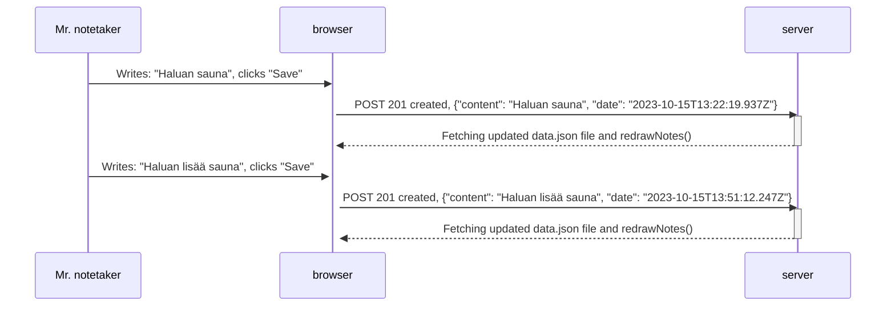

```mermaid
sequenceDiagram
    participant Mr. notetaker
    participant browser
    participant server

    Mr. notetaker->>browser: Writes: "Haluan sauna", clicks "Save"
    activate browser
    browser->>server: POST 201 created, {"content": "Haluan sauna", "date": "2023-10-15T13:22:19.937Z"}
    activate server
    server-->>browser: Fetching updated data.json file and redrawNotes()
    deactivate server

    Mr. notetaker->>browser: Writes: "Haluan lisää sauna", clicks "Save"
    activate browser
    browser->>server: POST 201 created, {"content": "Haluan lisää sauna", "date": "2023-10-15T13:51:12.247Z"}
    activate server
    server-->>browser: Fetching updated data.json file and redrawNotes()
    deactivate server


```
